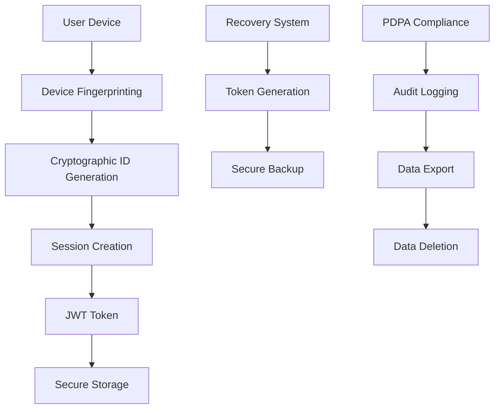

# 🔒 SATA Anonymous Authentication System

A privacy-first, PDPA-compliant authentication system that provides secure user authentication without collecting personal data.

## 🌟 Overview

The SATA Anonymous Authentication System is designed to provide secure user authentication while maintaining complete user anonymity and privacy. It uses cryptographic methods to generate unique identifiers, device fingerprinting for security, and implements comprehensive PDPA compliance features.

## ✨ Key Features

### 🔐 Anonymous Authentication

- **No Personal Data Required**: Users can authenticate without providing any personal information
- **Cryptographic Identifiers**: Unique anonymous IDs generated using UUID v4 with additional entropy
- **Secure by Design**: SHA-256 hashing ensures identifier uniqueness and security

### 📱 Device-Based Security

- **Hardware Fingerprinting**: Secure device recognition using browser and hardware characteristics
- **Canvas Fingerprinting**: Additional security layer using HTML5 canvas rendering differences
- **Multi-Factor Device Auth**: Combines multiple device characteristics for robust authentication

### 🔄 Account Recovery

- **Recovery Tokens**: Secure backup tokens for account recovery without personal data
- **Device-Based Recovery**: Alternative recovery method using trusted device verification
- **Zero-Knowledge Recovery**: Recover access without revealing personal information

### 📊 PDPA Compliance

- **Data Minimization**: Only essential data collected and stored
- **Right to Access**: Complete data export capabilities
- **Right to Deletion**: Full account and data deletion on request
- **Audit Logging**: Comprehensive activity logging for compliance
- **Data Portability**: Structured data export for migration

### ⚡ Advanced Features

- **Real-time Sessions**: JWT-based session management with automatic renewal
- **Trust Scoring**: Dynamic trust assessment based on behavior patterns
- **Multi-Language Support**: Internationalization support for global deployment
- **Responsive Design**: Mobile-first UI components

## 🚀 Quick Start

### 1. Installation

```bash
# Install required dependencies
npm install
```

### 2. Basic Setup

```typescript
import { AuthProvider, AuthWrapper } from "../components/AuthComponents";

function App() {
  return (
    <AuthProvider>
      <AuthWrapper requireAuth={true}>
        <YourAppContent />
      </AuthWrapper>
    </AuthProvider>
  );
}
```

### 3. Using Authentication in Components

```typescript
import { useAnonymousAuth } from "../hooks/useAnonymousAuth";

function UserProfile() {
  const { user, isAuthenticated, logout } = useAnonymousAuth();

  if (!isAuthenticated) return <div>Please log in</div>;

  return (
    <div>
      <p>Anonymous ID: {user.id}</p>
      <p>Trust Score: {user.trustScore}</p>
      <button onClick={logout}>Sign Out</button>
    </div>
  );
}
```

## 🏗️ Architecture

### Core Components

#### 1. AnonymousAuthenticationSystem

The main authentication engine that handles:

- User creation and management
- Session management
- Device fingerprinting
- Recovery token generation
- PDPA compliance operations

#### 2. useAnonymousAuth Hook

React hook providing:

- Authentication state management
- Login/logout functionality
- User data management
- Recovery operations

#### 3. AuthComponents

UI components including:

- Login interface
- Account management
- Recovery flows
- Settings management

### Security Architecture



## 🔧 Configuration

### Environment Setup

```typescript
const authSystem = new AnonymousAuthenticationSystem({
  sessionDuration: 24 * 60 * 60 * 1000, // 24 hours
  maxSessionsPerDevice: 3,
  recoveryTokenValidityPeriod: 7 * 24 * 60 * 60 * 1000, // 7 days
  maxRecoveryTokens: 5,
  auditRetentionPeriod: 365 * 24 * 60 * 60 * 1000, // 1 year
  trustScoreThreshold: 0.3,
});
```

### Customizable Options

| Option                        | Default  | Description                            |
| ----------------------------- | -------- | -------------------------------------- |
| `sessionDuration`             | 24 hours | How long sessions remain valid         |
| `maxSessionsPerDevice`        | 3        | Maximum concurrent sessions per device |
| `recoveryTokenValidityPeriod` | 7 days   | Recovery token expiration time         |
| `maxRecoveryTokens`           | 5        | Maximum recovery tokens per user       |
| `auditRetentionPeriod`        | 1 year   | How long audit logs are retained       |
| `trustScoreThreshold`         | 0.3      | Minimum trust score for access         |

## 🛡️ Security Features

### Device Fingerprinting

- **User Agent**: Browser and OS information
- **Screen Resolution**: Display characteristics
- **Timezone**: User's timezone setting
- **Language**: Browser language preferences
- **Platform**: Operating system platform
- **Canvas Fingerprint**: Unique rendering characteristics

### Session Security

- **JWT Tokens**: Cryptographically signed session tokens
- **Automatic Renewal**: Sessions renewed before expiration
- **Secure Storage**: Tokens stored securely in browser
- **Cross-Tab Sync**: Session state synchronized across browser tabs

### Trust Scoring Algorithm

```typescript
const calculateTrustScore = (user: AnonymousUser): number => {
  let score = 0.5; // Base score

  // Device consistency (40% weight)
  if (user.deviceFingerprint === getCurrentDeviceFingerprint()) {
    score += 0.4;
  }

  // Session history (30% weight)
  const sessionHistory = user.sessionCount / 10;
  score += Math.min(sessionHistory * 0.3, 0.3);

  // Account age (20% weight)
  const accountAge = (Date.now() - user.createdAt) / (30 * 24 * 60 * 60 * 1000);
  score += Math.min(accountAge * 0.2, 0.2);

  // Usage patterns (10% weight)
  score += user.preferences ? 0.1 : 0;

  return Math.min(score, 1.0);
};
```

## 📋 PDPA Compliance

### Data Collection

The system collects only the minimum necessary data:

- **Anonymous Identifier**: Cryptographically generated UUID
- **Device Fingerprint**: Non-personal device characteristics
- **Session Data**: Authentication tokens and session metadata
- **User Preferences**: Optional settings chosen by user
- **Audit Logs**: Activity logs for compliance (anonymized)

### User Rights Implementation

#### Right to Access

```typescript
const handleExportData = async () => {
  const data = await exportData();
  // Data exported in JSON format
  // Includes all user data in structured format
};
```

#### Right to Deletion

```typescript
const handleDeleteAccount = async () => {
  await deleteAccount();
  // Completely removes user data
  // Anonymizes audit logs
  // Revokes all sessions
};
```

#### Right to Portability

```typescript
const exportedData = {
  user: {
    id: "anonymous_identifier",
    createdAt: "timestamp",
    preferences: {
      /* user settings */
    },
  },
  sessions: [
    /* session history */
  ],
  auditLogs: [
    /* activity logs */
  ],
};
```

## 🔄 Recovery System

### Recovery Token Generation

```typescript
const generateRecoveryTokens = async () => {
  // Generates 5 unique recovery tokens
  // Each token is cryptographically secure
  // Tokens are hashed before storage
  // Valid for 7 days by default
};
```

### Recovery Process

1. User provides recovery token
2. System validates token against stored hash
3. Device fingerprint is verified
4. New session is created if successful
5. Recovery token is invalidated after use

## 📊 Analytics and Monitoring

### User Analytics (Anonymized)

- Active user count
- Session duration statistics
- Device type distribution
- Geographic distribution (country level)
- Feature usage patterns

### Security Monitoring

- Failed authentication attempts
- Suspicious device changes
- Token usage patterns
- Trust score distributions

### Compliance Monitoring

- Data access requests
- Deletion requests
- Audit log statistics
- Privacy setting preferences

## 🌐 API Reference

### Authentication Methods

#### `createAnonymousAccount(deviceInfo, preferences, ip?)`

Creates a new anonymous user account.

**Parameters:**

- `deviceInfo`: Device fingerprinting data
- `preferences`: User preferences object
- `ip?`: Optional IP address (anonymized)

**Returns:** `Promise<AuthResult | null>`

#### `authenticateWithDevice(fingerprint, ip?)`

Authenticates user based on device fingerprint.

**Parameters:**

- `fingerprint`: Device fingerprint string
- `ip?`: Optional IP address

**Returns:** `Promise<AuthResult | null>`

#### `validateSession(token)`

Validates an existing session token.

**Parameters:**

- `token`: JWT session token

**Returns:** `Promise<AuthResult | null>`

### Data Management Methods

#### `exportUserData(userId)`

Exports all user data in structured format.

**Parameters:**

- `userId`: Anonymous user identifier

**Returns:** `Promise<UserExportData>`

#### `deleteUserData(userId)`

Permanently deletes all user data.

**Parameters:**

- `userId`: Anonymous user identifier

**Returns:** `Promise<boolean>`

## 🔧 Troubleshooting

### Common Issues

#### Authentication Failures

- **Cause**: Device fingerprint changes
- **Solution**: Use recovery tokens or re-authenticate

#### Session Expiration

- **Cause**: Token expired or invalidated
- **Solution**: Automatic re-authentication will trigger

#### Recovery Token Issues

- **Cause**: Token expired or already used
- **Solution**: Generate new recovery tokens

### Debug Mode

```typescript
// Enable debug logging
localStorage.setItem("sata_auth_debug", "true");

// View auth system state
console.log(authSystem.getStats());
```

## 🚀 Deployment

### Production Checklist

- [ ] Configure session duration appropriately
- [ ] Set up audit log retention policies
- [ ] Implement IP anonymization
- [ ] Configure trust score thresholds
- [ ] Set up monitoring and alerting
- [ ] Review PDPA compliance settings
- [ ] Test recovery procedures
- [ ] Validate security measures

### Environment Variables

```env
SATA_AUTH_SESSION_DURATION=86400000
SATA_AUTH_MAX_SESSIONS=3
SATA_AUTH_RECOVERY_VALIDITY=604800000
SATA_AUTH_AUDIT_RETENTION=31536000000
SATA_AUTH_TRUST_THRESHOLD=0.3
```

## 📈 Performance Considerations

- **Memory Usage**: Approximately 50KB per active session
- **Storage**: 1-2KB per user in localStorage
- **Network**: Minimal overhead with JWT tokens
- **CPU**: Efficient cryptographic operations
- **Scalability**: Stateless design supports horizontal scaling

## 🔒 Security Best Practices

1. **Regular Token Rotation**: Implement automatic token refresh
2. **Secure Storage**: Use secure browser storage mechanisms
3. **HTTPS Only**: Ensure all communications use HTTPS
4. **Rate Limiting**: Implement authentication rate limiting
5. **Monitoring**: Monitor for suspicious activities
6. **Updates**: Keep dependencies up to date

## 📚 Additional Resources

- [PDPA Compliance Guide](https://www.pdpc.gov.sg)
- [JWT Security Best Practices](https://tools.ietf.org/html/rfc7519)
- [Device Fingerprinting Techniques](https://en.wikipedia.org/wiki/Device_fingerprint)
- [React Authentication Patterns](https://reactjs.org/docs/context.html)

## 🤝 Contributing

1. Fork the repository
2. Create a feature branch
3. Implement changes with tests
4. Ensure PDPA compliance
5. Submit a pull request

## 📄 License

This project is licensed under the MIT License - see the LICENSE file for details.

## 🙋‍♂️ Support

For support and questions:

- Create an issue in the repository
- Contact the development team
- Review the documentation

---

**Note**: This authentication system is designed for privacy-first applications. Ensure you understand the security implications and compliance requirements for your specific use case.
